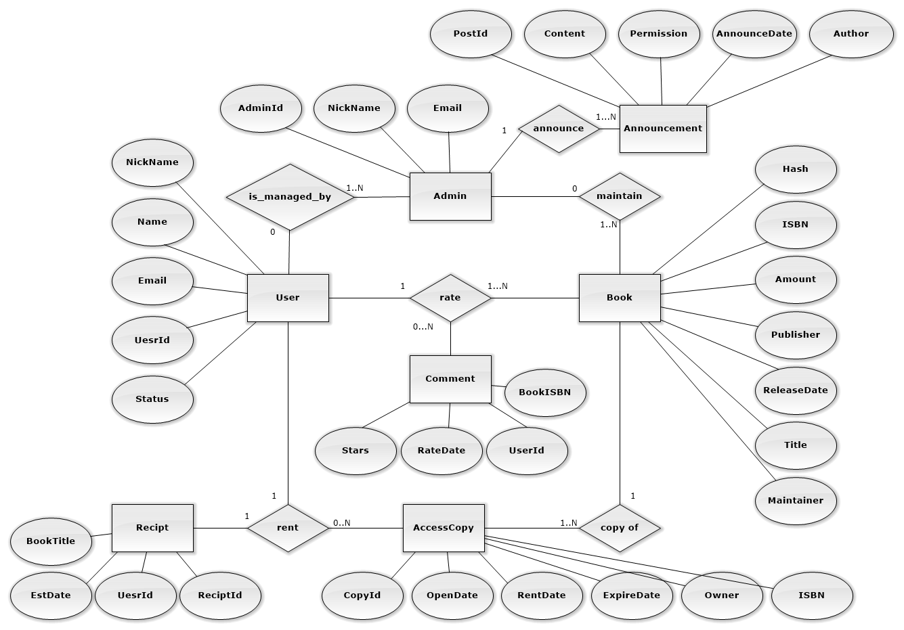

# Part I

[討論(Github Issue)](https://github.com/NFU-Database-Group/Project-Library/issues/1)

## 目錄

- [Part I](#part-i)
  - [目錄](#目錄)
  - [應用情境](#應用情境)
  - [使用案例](#使用案例)
    - [使用案例圖](#使用案例圖)
    - [使用者](#使用者)
    - [書城管理員](#書城管理員)
  - [系統需求說明](#系統需求說明)
    - [系統概述](#系統概述)
    - [功能需求](#功能需求)
    - [功能性需求](#功能性需求)
    - [非功能性需求](#非功能性需求)
  - [完整性限制](#完整性限制)
  - [ERD及詳細說明](#erd及詳細說明)
    - [實體](#實體)
    - [關聯](#關聯)

## 應用情境

當新學期開始，你正準備修習幾門新課，卻發現教材清單長得嚇人，有些書在圖書館早已被借光，有些則不知道該去哪裡找。你想要快速掌握每門課的指定用書、看看有沒有人分享過使用心得，甚至希望能線上預約或直接閱讀電子版。這時，「校園線上書城」就是你最好的幫手——它整合課程書單、圖書館藏、電子資源，讓你在一個平台上就能輕鬆找到或借閱需要的書籍。不再奔波於各大網站或書局，專注學習就是這麼簡單。以下是幾個具體的應用情境：

## 使用案例

### 使用案例圖

### 使用者

### 書城管理員

## 系統需求說明

### 系統概述

本系統旨在協助使用者透過線上平台快速搜尋與取得所需書籍，支援館藏借閱與電子書閱讀。系統主要功能包括會員管理、書籍管理、借閱與預約管理、線上閱讀以及查詢。

### 功能需求

1. **會員管理**
   - 支援校園電子信箱登入，以及密碼重設  
   - 會員可修改暱稱、聯絡方式等個人資訊  
   - 會員可查詢借閱與閱讀歷史紀錄  
   - 管理員可檢視會員總數與基本統計（無法查看會員敏感個人資料）  

2. **書城館藏管理**
   - 管理員可新增、修改、刪除書籍資料（書名、作者、出版社、類別）  
   - 設定電子書與實體書庫存量、借閱上限與到期提醒  
   - 支援書籍分類、關鍵字搜尋與多種排序（類別、熱門、最新）  
   - 自動標示庫存不足或新書上架通知  

3. **使用者書籍管理**
   - 使用者可線上申請借閱電子書或歸還電子書  
   - 追蹤閱讀進度並儲存書籤、螢光筆筆記  
   - 書籍逾期提醒與自動歸還  

4. **正版授權管理**
   - 管理員可上傳、管理出版社授權合約與版本  
   - 根據授權條款限制影本數量、有效期限  
   - 自動追蹤授權到期並發送續約提醒  

5. **線上閱讀功能**
   - 響應式設計，支援電腦、平板與手機跨裝置閱讀  
   - 閱讀工具：文字大小調整、夜間模式、全文搜尋  
   - 筆記與書籤：在頁面上標註螢光筆筆記或是標記為書籤  

6. **安全性**
   - 每個電子書正本、影本都會儲存其 SHA256 雜湊值  
   - 防範 SQL 注入、跨站腳本攻擊（XSS）及暴力破解  

### 功能性需求

- 帳戶管理
  - 讀者或書城管理員可以建立帳號
  - 讀者或書城管理員可以修改帳戶資訊 (如重設密碼等)
  - 書城管理員可以調閱讀者非機密性資訊
- 借閱管理
  - 讀者可以借閱、歸還書籍
  - 書籍有逾期日期屬性
  - 讀者可以查詢借閱紀錄
- 書籍查詢
  - 讀者可以透過ISBN和書名等方式搜尋書籍
- 館藏管理
  - 書城管理員可以管理館藏書籍 (如新增、修改和刪除等)

### 非功能性需求

- 前端圖形化介面
  - 前端響應式設計
  - 黑白主題選項

## 完整性限制

- **User**
  | 欄位名稱 | 欄位說明 | 資料型態                   | 值域                         | 是否為空 |
  |----------|--------|----------------------------|----------------------------|---------|
  | userId   | 使用者ID | `VARCHAR(8)` (8 bytes)     | 八位數字或一字母搭配五位數字 | 否       |
  | name     | 姓名     | `VARCHAR(20)` (20 bytes)   | 無特殊符號之非空字串         | 否       |
  | email    | 電子郵件 | `VARCHAR(255)` (255 bytes) | 符合電子郵件格式的字串       | 否       |

- **Admin**
  | 欄位名稱 | 欄位說明 | 資料型態                     | 值域                   | 是否為空 |
  |----------|--------|------------------------------|----------------------|---------|
  | adminId  | 管理員ID | `INT(11) UNSIGNED` (4 bytes) | 僅限正整數             | 否       |
  | name     | 姓名     | `VARCHAR(20)` (20 bytes)     | 無特殊符號之非空字串   | 否       |
  | email    | 電子郵件 | `VARCHAR(255)` (255 bytes)   | 符合電子郵件格式的字串 | 否       |

- **Book**
  | 欄位名稱    | 欄位說明 | 資料型態                     | 值域                  | 是否為空 |
  |-------------|--------|------------------------------|-----------------------|---------|
  | bookId      | 書籍ID   | `INT(11) UNSIGNED` (4 bytes) | 僅限正整數            | 否       |
  | ISBN        | 書籍ISBN | `VARCHAR(13)`     (13 bytes) | 必須符合 ISBN-13 格式 | 否       |
  | amount      | 正本數量 | `INT(11) UNSIGNED` (4 bytes) | 僅限正整數            | 否       |
  | publisher   | 出版社   | `VARCHAR(255)`   (255 bytes) | 任意非空字串          | 否       |
  | releaseDate | 出版日期 | `DATE`            (3 bytes)  | yyyy-MM-dd            | 否       |

- **Title**
  | 欄位名稱 | 欄位說明                               | 資料型態                      | 值域                | 是否為空 |
  |----------|--------------------------------------|-------------------------------|-------------------|---------|
  | titleId  | 標題ID                                 | `INT(11) UNSIGNED` (4 bytes)  | 僅限正整數          | 否       |
  | bookId   | 參照書籍ID                             | `INT(11) UNSIGNED` (4 bytes)  | 參考 Book 的 bookId | 否       |
  | language | ISO 639-1 或 ISO 639-2格式標記標題語言 | `VARCHAR(3)`        (3 bytes) | 2~3個小寫英文字母   | 否       |
  | title    | 標題文字                               | `VARCHAR(255)`    (255 bytes) | 任意非空字串        | 否       |

- **AccessCopy**
  | 欄位名稱   | 欄位說明 | 資料型態                     | 值域                | 是否為空 |
  |------------|--------|------------------------------|---------------------|---------|
  | copyId     | 副本ID   | `INT(11) UNSIGNED` (4 bytes) | 僅限正整數          | 否       |
  | openDate   | 借閱日期 | `DATE`             (3 bytes) | yyyy-MM-dd          | 否       |
  | expireDate | 逾期日期 | `DATE`             (3 bytes) | yyyy-MM-dd          | 否       |
  | owner      | 擁有者   | `VARCHAR(8)`       (8 bytes) | 參照 User 的 userId | 否       |

## ERD及詳細說明

### 實體

1. **User**
   - 屬性
      - UserId（**主鍵**；使用者ID）
      - Name（姓名）
      - Email（電子郵件）
   - 關聯
     - is_managed_by：使用者被零或一位管理員管理
     - rent：使用者借閱零至多份副本（AccessCopy）
     - read：使用者可閱讀零至多份副本（AccessCopy）

2. **Admin**
   - 屬性
     - AdminId（**主鍵**；管理員ID）
   - 關聯
     - is_managed_by：管理員管理一至多位使用者
     - maintain：管理員管理一至多本書籍

3. **Book**
   - 屬性
     - BookId（**主鍵**；書籍ID）
     - ISBN（書籍ISBN）
     - Amount（正本數量）
     - Publisher（出版社）
     - Release Date（出版日期）
   - 關聯
     - maintain：書籍管理零個管理員
     - copy of：書籍可被複製成一至多份副本（AccessCopy），並具備時間戳記
     - contain：書籍包含一至多個標題 (Title)

4. **Title**
   - 屬性
     - TitleId (**主鍵**；標題ID)
     - BookId (**外鍵**；連結到Book資料表)
     - language (標題語言)
     - title (標題文字)
   - 關聯
     - contain：標題包含一個書籍

5. **AccessCopy**
   - 屬性
     - CopyId（**主鍵**；副本ID）
     - OpenDate（借閱日期）
     - ExpireDate（逾期日期）
     - Owner（擁有者）
   - 關聯
     - read：副本被一位使用者閱讀
     - copy of：副本對應一本原始書籍（Book）

### 關聯

1. 「User」與「Admin」有一對多（1..N）管理關係（is_managed_by），一位使用者可以被零或一位管理員管理（0..1），而一位管理員可以管理一至多位使用者（1..N）。
2. 「User」與「AccessCopy」有一對多（0..N）借閱關係（rent），一位使用者可以借閱零至多份副本（0..N），而每一份副本只能被一位使用者借出（1）。
3. 「User」與「AccessCopy」有一對多（0..N）閱讀關係（read），一位使用者可以閱讀零至多份副本（0..N），而每份副本只能被一位使用者閱讀（1）。
4. 「Admin」與「Book」有一對多（1..N）管理關係（maintain），一位管理員可以管理一至多本書（1..N），而一本書可以沒有管理員維護（0）。
5. 「AccessCopy」與「Book」有一對多（1..N）來源關係（copy of），一本書可以被複製成零至多份副本（0..N），而每份副本只能對應一本書籍（1），並記錄複製時間戳記。
