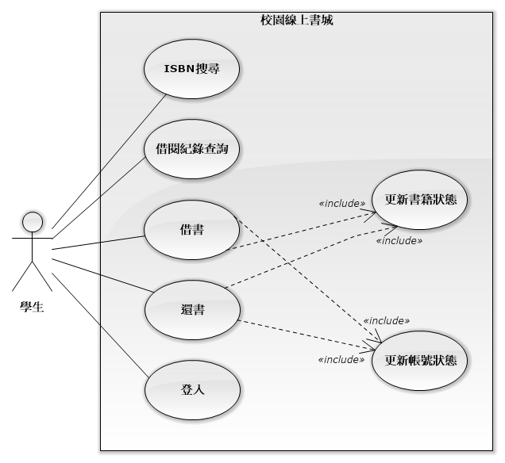

# Campus Digital Bookstore

## 目錄

- [Campus Digital Bookstore](#campus-digital-bookstore)
  - [目錄](#目錄)
  - [應用情境](#應用情境)
  - [使用案例](#使用案例)
    - [使用案例圖](#使用案例圖)
    - [學生角色](#學生角色)
    - [書城管理員角色](#書城管理員角色)
  - [系統需求說明](#系統需求說明)
    - [系統概述](#系統概述)
    - [功能需求](#功能需求)
    - [功能性需求](#功能性需求)
    - [非功能性需求](#非功能性需求)
  - [完整性限制](#完整性限制)
  - [ERD及詳細說明](#erd及詳細說明)
    - [實體](#實體)
    - [關聯](#關聯)

## 應用情境

當新學期開始，你正準備修習幾門新課，卻發現教材清單長得嚇人，有些書在圖書館早已被借光，有些則不知道該去哪裡找。你想要快速掌握每門課的指定用書、看看有沒有人分享過使用心得，甚至希望能線上預約或直接閱讀電子版。這時，「校園線上書城」就是你最好的幫手——它整合課程書單、圖書館藏、電子資源，讓你在一個平台上就能輕鬆找到或借閱需要的書籍。不再奔波於各大網站或書局，專注學習就是這麼簡單。以下是幾個具體的應用情境：

- 線上借書，以數位化的方式線上閱讀書籍  
  1. **情境描述：**  
     張小華是一名大三生，期末報告需要多本參考書。他打開校園線上書城，先以學校帳號快速登入。接著，他在搜尋欄輸入課程名稱，立即看到《現代資料庫系統概論》的電子書和實體書選項。考慮到時間緊迫，他選擇了電子書借閱，系統依照出版社授權自動核准並顯示借閱期限與閱讀須知。確認後，他一邊在網頁上閱讀，還能隨時標註重點；到期前系統也在首頁醒目位置提醒他延長或歸還。整個流程不到三分鐘，他就完成借閱並開始專注閱讀，無需排隊或等待實體還書。  
  2. **系統應用：**  
     1. 學生以校園帳號登入線上書城，系統自動載入其借閱額度、歷史紀錄與閱讀偏好。  
     2. 在搜尋欄輸入關鍵字或課程名稱，系統即時篩選電子書並標示「可借閱」或「暫無授權」狀態。  
     3. 點選電子書後，一鍵申請借閱，系統依出版社授權自動核准，並立即將該書加入學生個人書架。  
     4. 核准後跳出借閱期限與閱讀須知。  
     5. 到期前，首頁與 Email 會以橫幅及推播提醒是否延長借閱或歸還。  

- 線上看書  
  1. **情境描述：**  
     張小華在通勤途中打開校園線上書城，點選「我的書架」裡剛借閱的《現代資料庫系統概論》電子書，一鍵進入閱讀模式。由於車廂顛簸，他將字體調大並開啟夜間模式，並在第二章重點段落做了螢光筆標註與新增頁邊筆記。下車後，他在校園 Wi-Fi 環境接續閱讀，閱讀進度自動同步到手機與平板，無縫串聯整個學習流程。  
  2. **系統應用：**  
     1. 學生以校園帳號登入後，系統自動載入當前借閱電子書清單與未讀進度。  
     2. 點選「線上閱讀」按鈕，系統開啟可跨裝置的閱讀介面，並根據使用裝置自動調整版面。  
     3. 閱讀工具列支援字體大小調整、頁面亮度切換（夜間/日間模式）及全文搜尋，提升閱讀舒適度。  
     4. 學生在頁面上做螢光標註或新增筆記時，系統即時將標註位置與內容同步至雲端個人筆記區。  

- 逾期還書  
  1. **情境描述：**  
     張小華因為期末準備繁忙，一整週都在實驗室做報告，沒注意到《現代資料庫系統概論》的借閱期限到了。系統在到期當日凌晨自動幫他完成歸還，並且沒有產生任何罰金或違約記錄。醒來後，他在手機通知欄看到「書籍已自動歸還」的提醒，並能馬上借下一本想讀的電子書，完全不用擔心逾期問題。  
  2. **系統應用：**
     1. 系統自動計算每本電子書的借閱到期日，並將自動歸還任務排程於到期當日午夜執行。
     2. 在到期前三天與當日早晨，首頁橫幅與 Email 會提醒學生剩餘借閱時間，讓他有機會提前延長。
     3. 到期午夜，系統執行歸還流程──更新書籍狀態、釋放借閱額度，並移除個人書架中的該書。
     4. 完成自動歸還後，系統即時推播與 Email 通知學生「已成功歸還」。
     5. 系統根據歸還行為更新學生偏好，並在下次登入或推薦中調整借閱提醒頻率，確保更貼心的借閱服務。

## 使用案例

### 使用案例圖


在此系統中，學生與管理員透過登入、搜尋、借還及帳號書籍管理功能互動。

### 學生角色



在此系統中，學生的使用過程包含以下幾個步驟：

1. 登入系統：學生輸入校園帳號與密碼完成身份驗證，對應資料庫中「UserId」欄位。
2. ISBN 搜尋：學生在搜尋欄輸入 ISBN，系統透過「ISBN」屬性查詢並顯示電子書詳細資訊。
3. 借書：選擇欲借之電子書，系統建立「AccessCopy」，並執行更新書籍狀態「Amount」及更新帳號借閱次數。
4. 還書：在到期或手動歸還時，系統更新該筆「AccessCopy」記錄狀態，並執行更新書籍狀態（Book.Amount 增加）及更新帳號狀態。
5. 借閱紀錄查詢：學生可查詢所有「AccessCopy」表中與自身「UserId」關聯之借閱紀錄，包含借出時間、到期時間與歸還狀態。

### 書城管理員角色


在此系統中，書城管理員的使用過程包含以下幾個步驟：

1. 登入系統：管理員輸入帳號與密碼完成身份驗證，對應資料庫中「AdminId」欄位。
2. 書籍管理：管理員可新增、修改或刪除書籍資訊，系統操作對應「Book」表中 BookId、ISBN、Amount、Publisher、ReleaseDate 等欄位，並觸發「更新書籍狀態」子流程。
3. 帳號管理：管理員可調整學生借閱額度或重設帳號狀態，系統更新「AccessCopy」及「User」表中的相關欄位，並執行「更新帳號狀態」子流程。
4. 學生管理：管理員可新增、修改或停用學生帳號，對應「User」表中 UserId、Name、Email 等欄位，並同樣包含「更新帳號狀態」子流程。

## 系統需求說明

### 系統概述

本系統旨在協助學生透過線上平台快速搜尋與取得所需書籍，支援館藏借閱與電子書閱讀。系統主要功能包括會員管理、書籍管理、借閱與預約管理、線上閱讀以及查詢。

### 功能需求

1. **學生帳號管理**
   - 支援校園電子信箱登入
   - 學生可查詢借閱與閱讀歷史紀錄

2. **書城館藏管理**
   - 書城管理員可新增、修改、刪除書籍資料（書名、作者、出版社、類別）
   - 設定電子書庫存量、副本借閱上限
   - 書籍類別分類、書名關鍵字搜尋
   - 自動標示庫存不足或新書上架通知

3. **學生電子書管理**
   - 學生可線上申請借閱電子書或歸還電子書副本
   - 追蹤閱讀進度並儲存螢光筆筆記
   - 電子書副本逾期提醒與自動歸還

4. **電子書副本授權**
   - 電子書借閱時產生唯一的副本給借閱的學生
   - 當書城管理員刪除正本電子書，所有副本同步刪除
   - 電子書副本歸還時，刪除該副本以及螢光筆筆記

5. **線上閱讀功能**
   - 響應式設計，支援電腦、平板與手機跨裝置閱讀
   - 閱讀工具：文字大小調整、書頁顏色、全文搜尋
   - 在頁面上標註螢光筆筆記

6. **安全性**
   - 每個電子書正本、副本都會儲存其 SHA256 雜湊值

### 功能性需求

- 帳戶管理
  - 讀者或書城管理員可以建立帳號
  - 讀者或書城管理員可以修改帳戶資訊 (如重設密碼等)
  - 書城管理員可以調閱讀者非機密性資訊
- 借閱管理
  - 讀者可以借閱、歸還書籍
  - 書籍有逾期日期屬性
  - 讀者可以查詢借閱紀錄
- 書籍查詢
  - 讀者可以透過ISBN和書名等方式搜尋書籍
- 館藏管理
  - 書城管理員可以管理館藏書籍 (如新增、修改和刪除等)

### 非功能性需求

- 前端圖形化介面
  - 前端響應式設計
  - 黑白主題選項

## 完整性限制

### **User**

  | 欄位名稱 | 欄位說明 | 資料型態                   | 值域                         | 是否為空 |
  |----------|--------|----------------------------|----------------------------|---------|
  | UserId   | 學生ID | `VARCHAR(8)` (8 bytes)     | 第一碼：只能是 4 或 5、第二、三碼：必須為兩位數字，範圍從 01 到 99、第四碼：固定為 4、第五碼：只能是 0–9（任一數字）、第六碼：只能是 0–3（任一數字）、第七、八碼：必須為兩位數字，範圍從 01 到 99 | 否       |
  | Name     | 姓名     | `VARCHAR(20)` (20 bytes)   | 無特殊符號之非空字串，允許英文、中文字元和一些特殊字元，如： `·`、`・`、`-`、`（`、`）`         | 否       |
  | Email    | 電子郵件 | `VARCHAR(255)` (255 bytes) | 學校電子郵件格式，學號 + `@nfu.edu.tw`，學號值域參見 `UserId`       | 否       |

- 成功輸入範例

  ```bash
  MariaDB [cdb_db]> INSERT INTO users (UserId, Name, Email) VALUES (41143281, '陳小明', '41143281@nfu.edu.tw');
  Query OK, 1 row affected (0.006 sec)

  MariaDB [cdb_db]> INSERT INTO users (UserId, Name, Email) VALUES (41143282, 'Smith', '41143282@nfu.edu.tw');
  Query OK, 1 row affected (0.009 sec)

  MariaDB [cdb_db]> SELECT * FROM users;
  +----------+-----------+---------------------+
  | UserId   | Name      | Email               |
  +----------+-----------+---------------------+
  | 41143281 | 陳小明    | 41143281@nfu.edu.tw |
  | 41143282 | Smith     | 41143282@nfu.edu.tw |
  +----------+-----------+---------------------+
  2 rows in set (0.007 sec)
  ```

- 錯誤輸入範例

  ```bash
  MariaDB [cdb_db]> INSERT INTO users (UserId, Name, Email) VALUES (12345678, 'Smith', '41143283@nfu.edu.tw');
  ERROR 4025 (23000): CONSTRAINT `CONSTRAINT_1` failed for `cdb_db`.`users`
  MariaDB [cdb_db]> INSERT INTO users (UserId, Name, Email) VALUES (41143283, 'Smith@123', '41143283@nfu.edu.tw');
  ERROR 4025 (23000): CONSTRAINT `CONSTRAINT_2` failed for `cdb_db`.`users`
  MariaDB [cdb_db]> INSERT INTO users (UserId, Name, Email) VALUES (41143283, 'Smith', '41143283@npu.edu.tw');
  ERROR 4025 (23000): CONSTRAINT `CONSTRAINT_3` failed for `cdb_db`.`users`
  ```

### **Admin**

  | 欄位名稱 | 欄位說明 | 資料型態                     | 值域                   | 是否為空 |
  |----------|--------|------------------------------|----------------------|---------|
  | AdminId  | 管理員ID | `INT(11) UNSIGNED` (4 bytes) | 僅限正整數             | 否       |
  | Name     | 姓名     | `VARCHAR(20)` (20 bytes)     | 無特殊符號之非空字串，允許英文、中文字元和一些特殊字元，如： `·`、`・`、`-`、`（`、`）`   | 否       |
  | Email    | 電子郵件 | `VARCHAR(255)` (255 bytes)   | 學校電子郵件格式，學號 + `@nfu.edu.tw`，學號值域參見 `UserId` | 否       |

- 成功輸入範例

  ```bash
  MariaDB [cdb_db]> INSERT INTO admin (Name, Email) VALUES ('陳曉明', '41143281@nfu.edu.tw');
  MariaDB [cdb_db]> SELECT * FROM admin;
  +---------+-----------+---------------------+
  | AdminId | Name      | Email               |
  +---------+-----------+---------------------+
  |       1 | 陳曉明    | 41143281@nfu.edu.tw |
  +---------+-----------+---------------------+
  1 row in set (0.004 sec)
  ```

- 錯誤輸入範例

  ```bash
  MariaDB [cdb_db]> INSERT INTO admin (Name, Email) VALUES ('陳曉明@123', '41143281@nfu.edu.tw');
  ERROR 4025 (23000): CONSTRAINT `CONSTRAINT_1` failed for `cdb_db`.`admin`
  MariaDB [cdb_db]> INSERT INTO admin (Name, Email) VALUES ('陳曉明', '41143281@npu.edu.tw');
  ERROR 4025 (23000): CONSTRAINT `CONSTRAINT_2` failed for `cdb_db`.`admin`
  ```

### **Book**

  | 欄位名稱    | 欄位說明 | 資料型態                     | 值域                  | 是否為空 |
  |-------------|--------|------------------------------|-----------------------|---------|
  | BookId      | 書籍ID   | `INT(11) UNSIGNED` (4 bytes) | 僅限正整數 0 ~ $10^{11}-1$            | 否       |
  | Category        | 書籍類型 | `VARCHAR(255)`   (255 bytes) | 非空字串，允許中、英文字元和一些特殊字元，如： `·`、`・`、`-`、`（`、`）`          | 否       |
  | Hash       | 雜湊值   | `VARCHAR(16)`     (16 bytes) | 十六進制字元，英文使用小寫或大寫都可以 | 否       |
  | ISBN        | 書籍ISBN | `VARCHAR(13)`     (13 bytes) | 符合 ISBN-13 或 ISBN-10格式，ISBN-13 需以978或979開頭，接著十位數字；ISBN-10 則是九位數字接著一位數字或字母X或x | 否       |
  | Amount      | 正本數量 | `INT(11) UNSIGNED` (4 bytes) | 僅限正整數 0 ~ $10^{11}-1$            | 否       |
  | Publisher   | 出版社   | `VARCHAR(255)`   (255 bytes) | 非空字串，允許中、英文字元和一些特殊字元，如： `·`、`・`、`-`、`（`、`）`          | 否       |
  | ReleaseDate | 出版日期 | `DATE`            (3 bytes)  | 依照日期格式 yyyy-mm-dd 填入數字           | 否       |

- 成功輸入範例

  ```bash
  MariaDB [cdb_db]> INSERT INTO `book` (`Category`, `Hash`, `ISBN`, `Amount`, `Publisher`, `ReleaseDate`) VALUES
      -> ('科學', '1234567890abcdef', '9781234567890', 5, '科學出版社', '2023-01-01'),
      -> ('文學', 'fedcba0987654321', '9791234567890', 3, '文學出版社', '2022-12-31');
  Query OK, 2 rows affected (0.021 sec)
  Records: 2  Duplicates: 0  Warnings: 0

  MariaDB [cdb_db]> SELECT * FROM book;
  +--------+----------+------------------+---------------+--------+-----------------+-------------+
  | BookId | Category | Hash             | ISBN          | Amount | Publisher       | ReleaseDate |
  +--------+----------+------------------+---------------+--------+-----------------+-------------+
  |      1 | 科學     | 1234567890abcdef | 9781234567890 |      5 | 科學出版社      | 2023-01-01  |
  |      2 | 文學     | fedcba0987654321 | 9791234567890 |      3 | 文學出版社      | 2022-12-31  |
  +--------+----------+------------------+---------------+--------+-----------------+-------------+
  2 rows in set (0.008 sec)
  ```

- 錯誤輸入範例

  ```bash
  MariaDB [cdb_db]> INSERT INTO book (`Category`, `Hash`, `ISBN`, `Amount`, `Publisher`, `ReleaseDate`) VALUES ('科學', 'abca123764feab22', '1231231231231', 7, '科學出版社', '2022-09-09');
  ERROR 4025 (23000): CONSTRAINT `CONSTRAINT_3` failed for `cdb_db`.`book`
  ```

### **Title**

  | 欄位名稱 | 欄位說明                               | 資料型態                      | 值域                | 是否為空 |
  |----------|--------------------------------------|-------------------------------|-------------------|---------|
  | TitleId  | 標題ID                                 | `INT(11) UNSIGNED` (4 bytes)  | 僅限正整數 0 ~ $10^{11}-1$          | 否       |
  | BookId   | 參照書籍ID                             | `INT(11) UNSIGNED` (4 bytes)  | 參考 Book 的 BookId | 否       |
  | Language | ISO 639-1 或 ISO 639-2 格式標記標題語言 | `VARCHAR(3)`        (3 bytes) | 二至三個小寫英文字母，第一個字母可以是大寫   | 否       |
  | TitleName    | 標題文字                               | `VARCHAR(255)`    (255 bytes) | 非空字串，允許中、英文字元和一些特殊字元，如： `·`、`・`、`-`、`（`、`）`        | 否       |

- 成功輸入範例

  ```bash
  MariaDB [cdb_db]> INSERT INTO `title` (`BookId`, `Language`, `TitleName`) VALUES
      -> (1, 'zh', '科學探索'),
      -> (1, 'en', 'Scientific Exploration'),
      -> (2, 'zh', '文學之旅'),
      -> (2, 'en', 'Literary Journey');
  Query OK, 4 rows affected (0.084 sec)
  Records: 4  Duplicates: 0  Warnings: 0

  MariaDB [cdb_db]> SELECT * FROM title;
  +---------+--------+----------+------------------------+
  | TitleId | BookId | Language | TitleName              |
  +---------+--------+----------+------------------------+
  |       1 |      1 | zh       | 科學探索               |
  |       2 |      1 | en       | Scientific Exploration |
  |       3 |      2 | zh       | 文學之旅               |
  |       4 |      2 | en       | Literary Journey       |
  +---------+--------+----------+------------------------+
  4 rows in set (0.022 sec)
  ```

- 錯誤輸入範例

  ```bash
  MariaDB [cdb_db]> INSERT INTO title (BookId, Language, TitleName) VALUES ('1', 'zh-TW', '科學探索');
  ERROR 1406 (22001): Data too long for column 'Language' at row 1
  MariaDB [cdb_db]> INSERT INTO title (BookId, Language, TitleName) VALUES ('1', 'zh@', '科學探索');
  ERROR 4025 (23000): CONSTRAINT `CONSTRAINT_1` failed for `cdb_db`.`title`
  ```

### **AccessCopy**

  | 欄位名稱   | 欄位說明 | 資料型態                     | 值域                | 是否為空 |
  |------------|--------|------------------------------|---------------------|---------|
  | CopyId     | 副本ID   | `INT(11) UNSIGNED` (4 bytes) | 僅限正整數 0 ~ $10^{11}-1$          | 否       |
  | Hash       | 雜湊值   | `VARCHAR(16)`     (16 bytes) | 十六進制字元，英文使用小寫或大寫字母都可以 | 否       |
  | OpenDate   | 借閱日期 | `DATE`             (3 bytes) | 依照日期格式 yyyy-mm-dd 填入數字           | 否       |
  | ExpireDate | 逾期日期 | `DATE`             (3 bytes) | 依照日期格式 yyyy-mm-dd 填入數字           | 否       |
  | UserId      | 擁有者   | `VARCHAR(8)`       (8 bytes) | 參照 User 的 UserId | 否       |

- 成功輸入範例

  ```bash
  MariaDB [cdb_db]> INSERT INTO `copy` (`OpenDate`, `ExpireDate`, `Owner`, `Title`) VALUES
      -> ('2025-06-04', '2025-06-18', 41143281, 1),
      -> ('2025-06-02', '2025-06-16', 41143282, 2);
  Query OK, 2 rows affected (0.015 sec)
  Records: 2  Duplicates: 0  Warnings: 0

  MariaDB [cdb_db]> SELECT * FROM copy;
  +--------+------------+------------+----------+-------+
  | CopyId | OpenDate   | ExpireDate | Owner    | Title |
  +--------+------------+------------+----------+-------+
  |      1 | 2025-06-04 | 2025-06-18 | 41143281 |     1 |
  |      2 | 2025-06-02 | 2025-06-16 | 41143282 |     2 |
  +--------+------------+------------+----------+-------+
  2 rows in set (0.016 sec)
  ```

- 錯誤輸入範例

  ```bash
  MariaDB [cdb_db]> INSERT INTO `copy` (`OpenDate`, `ExpireDate`, `Owner`, `Title`) VALUES ('2025-06-04', '2024-06-18', 41143281, 1);
  ERROR 4025 (23000): CONSTRAINT `CONSTRAINT_1` failed for `cdb_db`.`copy`
  ```

### **Note**

  | 欄位名稱   | 欄位說明 | 資料型態                     | 值域                | 是否為空 |
  |------------|--------|------------------------------|---------------------|---------|
  | NoteId     | 螢光筆記ID   | `INT(11) UNSIGNED` (4 bytes) | 僅限正整數 0 ~ $10^{11}-1$          | 否       |
  | LineStart | 起始位置 | `DECIMAL(5,2)` (5 bytes) | 不允許負數，範圍從 0 到 300.00 | 否       |
  | LineEnd   | 結束位置 | `DECIMAL(5,2)` (5 bytes) | 不允許負數，範圍從 0 到 300.00 | 否       |
  | Copy      | 副本ID   | `INT(11) UNSIGNED` (4 bytes) | 參照 AccessCopy 的 CopyId | 否       |

- 成功輸入範例

  ```bash
  MariaDB [cdb_db]> INSERT INTO `note` (`LineStart`, `LineEnd`, `Copy`) VALUES
      -> (1.0, 2.0, 1),
      -> (3.5, 4.5, 2);
  Query OK, 2 rows affected (0.022 sec)
  Records: 2  Duplicates: 0  Warnings: 0

  MariaDB [cdb_db]> SELECT * FROM note;
  +--------+-----------+---------+------+
  | NoteId | LineStart | LineEnd | Copy |
  +--------+-----------+---------+------+
  |      1 |      1.00 |    2.00 |    1 |
  |      2 |      3.50 |    4.50 |    2 |
  +--------+-----------+---------+------+
  2 rows in set (0.007 sec)
  ```

- 錯誤輸入範例

  ```bash
  MariaDB [cdb_db]> INSERT INTO `note` (`LineStart`, `LineEnd`, `Copy`) VALUES (-1.0, 2.0, 1);
  ERROR 4025 (23000): CONSTRAINT `CONSTRAINT_1` failed for `cdb_db`.`note`
  ```

## ERD及詳細說明


### 實體

1. **User**
   - 屬性
      - UserId（**主鍵**；學生ID）
      - Name（姓名）
      - Email（電子郵件）
   - 關聯
     - is_managed_by：學生被零或一位管理員管理
     - rent：學生借閱零至多份副本（AccessCopy）
     - read：學生可閱讀零至多份副本（AccessCopy）

2. **Admin**
   - 屬性
     - AdminId（**主鍵**；管理員ID）
   - 關聯
     - is_managed_by：管理員管理一至多位學生
     - maintain：管理員管理一至多本書籍

3. **Book**
   - 屬性
     - BookId（**主鍵**；書籍ID）
     - ISBN（書籍ISBN）
     - Amount（正本數量）
     - Publisher（出版社）
     - Release Date（出版日期）
   - 關聯
     - maintain：書籍管理零個管理員
     - copy of：書籍可被複製成一至多份副本（AccessCopy），並具備時間戳記
     - contain：書籍包含一至多個標題 (Title)

4. **Title**
   - 屬性
     - TitleId (**主鍵**；標題ID)
     - BookId (**外鍵**；連結到Book資料表)
     - Language (標題語言)
     - Title (標題文字)
   - 關聯
     - Contain：標題包含一個書籍

5. **AccessCopy**
   - 屬性
     - CopyId（**主鍵**；副本ID）
     - OpenDate（借閱日期）
     - ExpireDate（逾期日期）
     - UserId（擁有者）
   - 關聯
     - read：副本被一位學生閱讀
     - copy of：副本對應一本原始書籍（Book）

### 關聯

1. 「User」與「Admin」有一對多（1..N）管理關係（is_managed_by），一位學生可以被零或一位管理員管理（0..1），而一位管理員可以管理一至多位學生（1..N）。
2. 「User」與「AccessCopy」有一對多（0..N）借閱關係（rent），一位學生可以借閱零至多份副本（0..N），而每一份副本只能被一位學生借出（1）。
3. 「User」與「AccessCopy」有一對多（0..N）閱讀關係（read），一位學生可以閱讀零至多份副本（0..N），而每份副本只能被一位學生閱讀（1）。
4. 「Admin」與「Book」有一對多（1..N）管理關係（maintain），一位管理員可以管理一至多本書（1..N），而一本書可以沒有管理員維護（0）。
5. 「AccessCopy」與「Book」有一對多（1..N）來源關係（copy of），一本書可以被複製成零至多份副本（0..N），而每份副本只能對應一本書籍（1），並記錄複製時間戳記。
6. 「Book」與「Title」有一對多（1..N）個書名（contain），一本書可以有多個不同翻譯的書名（0..N），而每個標題只有對應一本書（1）。
