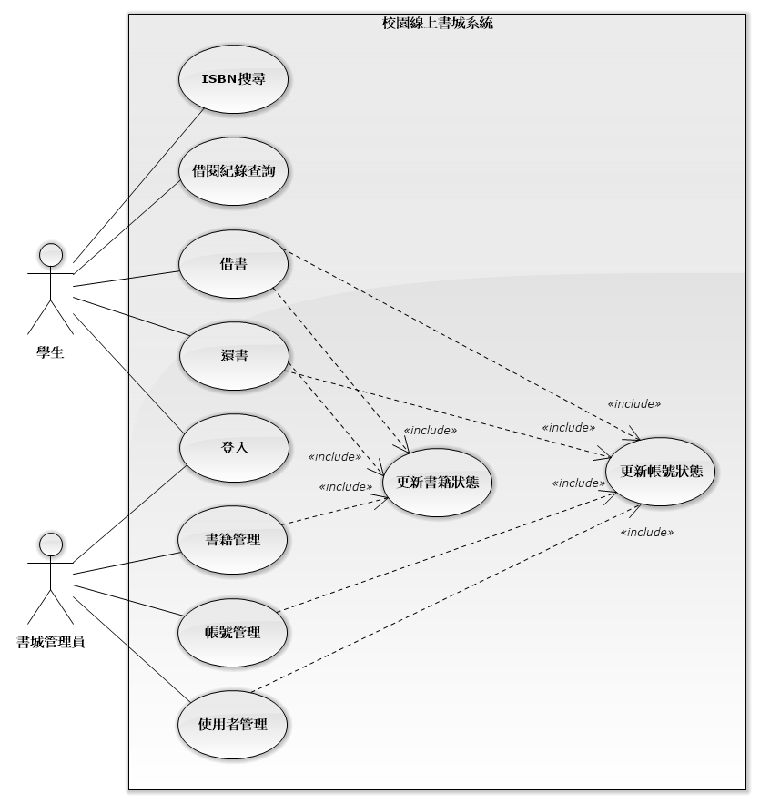

# Campus Digital Bookstore

## 目錄

- [Campus Digital Bookstore](#campus-digital-bookstore)
  - [目錄](#目錄)
  - [應用情境](#應用情境)
  - [使用案例](#使用案例)
    - [使用案例圖](#使用案例圖)
    - [學生角色](#學生角色)
    - [書城管理員角色](#書城管理員角色)
  - [系統需求說明](#系統需求說明)
    - [系統概述](#系統概述)
    - [功能需求](#功能需求)
    - [功能性需求](#功能性需求)
    - [非功能性需求](#非功能性需求)
  - [ERD及詳細說明](#erd及詳細說明)
    - [實體（Entities）](#實體entities)
    - [關聯（Relationsqlips）](#關聯relationsqlips)
  - [完整性限制](#完整性限制)
    - [**User**](#user)
    - [**Admin**](#admin)
    - [**Book**](#book)
    - [**AccessCopy**](#accesscopy)
    - [**Announcement**](#announcement)
    - [**Comment**](#comment)
    - [**Recipt**](#recipt)
  - [外部檢視](#外部檢視)
    - [1. 建立一般使用者與管理員帳號](#1-建立一般使用者與管理員帳號)
    - [2. 建立 External View](#2-建立-external-view)
      - [學生 view（僅能看到公開公告）](#學生-view僅能看到公開公告)
      - [管理員 view（可看到所有公告，包含 private）](#管理員-view可看到所有公告包含-private)
      - [權限設定](#權限設定)
    - [3. GROUP BY 與 HAVING 查詢功能](#3-group-by-與-having-查詢功能)
      - [3.1 查詢每個學生的借書數量（含姓名）](#31-查詢每個學生的借書數量含姓名)
      - [3.2 查詢有超過2筆借書記錄的學生](#32-查詢有超過2筆借書記錄的學生)
      - [3.3 查詢每本書被借閱的次數](#33-查詢每本書被借閱的次數)
      - [3.4 查詢每位管理員管理的書籍數量](#34-查詢每位管理員管理的書籍數量)
      - [3.5 查詢每本書的平均評分（只算有評分的）](#35-查詢每本書的平均評分只算有評分的)

## 應用情境

當新學期開始，你正準備修習幾門新課，卻發現教材清單長得嚇人，有些書在圖書館早已被借光，有些則不知道該去哪裡找。你想要快速掌握每門課的指定用書、看看有沒有人分享過使用心得，甚至希望能線上預約或直接閱讀電子版。這時，「校園線上書城」就是你最好的幫手——它整合課程書單、圖書館藏、電子資源，讓你在一個平台上就能輕鬆找到或借閱需要的書籍。不再奔波於各大網站或書局，專注學習就是這麼簡單。以下是幾個具體的應用情境：

- 線上借書，以數位化的方式線上閱讀書籍  
  1. **情境描述：**  
     張小華是一名大三生，期末報告需要多本參考書。他打開校園線上書城，先以學校帳號快速登入。接著，他在搜尋欄輸入課程名稱，立即看到《現代資料庫系統概論》的電子書和實體書選項。考慮到時間緊迫，他選擇了電子書借閱，系統依照出版社授權自動核准並顯示借閱期限與閱讀須知。確認後，他一邊在網頁上閱讀，還能隨時標註重點；到期前系統也在首頁醒目位置提醒他延長或歸還。整個流程不到三分鐘，他就完成借閱並開始專注閱讀，無需排隊或等待實體還書。  
  2. **系統應用：**  
     1. 學生以校園帳號登入線上書城，系統自動載入其借閱額度、歷史紀錄與閱讀偏好。  
     2. 在搜尋欄輸入關鍵字或課程名稱，系統即時篩選電子書並標示「可借閱」或「暫無授權」狀態。  
     3. 點選電子書後，一鍵申請借閱，系統依出版社授權自動核准，並立即將該書加入學生個人書架。  
     4. 核准後跳出借閱期限與閱讀須知。  
     5. 到期前，首頁與 Email 會以橫幅及推播提醒是否延長借閱或歸還。  

- 線上看書  
  1. **情境描述：**  
     張小華在通勤途中打開校園線上書城，點選「我的書架」裡剛借閱的《現代資料庫系統概論》電子書，一鍵進入閱讀模式。由於車廂顛簸，他將字體調大並開啟夜間模式，並在第二章重點段落做了螢光筆標註與新增頁邊筆記。下車後，他在校園 Wi-Fi 環境接續閱讀，閱讀進度自動同步到手機與平板，無縫串聯整個學習流程。  
  2. **系統應用：**  
     1. 學生以校園帳號登入後，系統自動載入當前借閱電子書清單與未讀進度。  
     2. 點選「線上閱讀」按鈕，系統開啟可跨裝置的閱讀介面，並根據使用裝置自動調整版面。  
     3. 閱讀工具列支援字體大小調整、頁面亮度切換（夜間/日間模式）及全文搜尋，提升閱讀舒適度。  
     4. 學生在頁面上做螢光標註或新增筆記時，系統即時將標註位置與內容同步至雲端個人筆記區。  

- 逾期還書  
  1. **情境描述：**  
     張小華因為期末準備繁忙，一整週都在實驗室做報告，沒注意到《現代資料庫系統概論》的借閱期限到了。系統在到期當日凌晨自動幫他完成歸還，並且沒有產生任何罰金或違約記錄。醒來後，他在手機通知欄看到「書籍已自動歸還」的提醒，並能馬上借下一本想讀的電子書，完全不用擔心逾期問題。  
  2. **系統應用：**
     1. 系統自動計算每本電子書的借閱到期日，並將自動歸還任務排程於到期當日午夜執行。
     2. 在到期前三天與當日早晨，首頁橫幅與 Email 會提醒學生剩餘借閱時間，讓他有機會提前延長。
     3. 到期午夜，系統執行歸還流程──更新書籍狀態、釋放借閱額度，並移除個人書架中的該書。
     4. 完成自動歸還後，系統即時推播與 Email 通知學生「已成功歸還」。
     5. 系統根據歸還行為更新學生偏好，並在下次登入或推薦中調整借閱提醒頻率，確保更貼心的借閱服務。

## 使用案例

### 使用案例圖



在此系統中，學生與管理員透過登入、搜尋、借還及帳號書籍管理功能互動。

### 學生角色


在此系統中，學生的使用過程包含以下幾個步驟：

1. 登入系統：學生輸入校園帳號與密碼完成身份驗證，對應資料庫中「UserId」欄位。
2. ISBN 搜尋：學生在搜尋欄輸入 ISBN，系統透過「ISBN」屬性查詢並顯示電子書詳細資訊。
3. 借書：選擇欲借之電子書，系統建立「AccessCopy」，並執行更新書籍狀態「Amount」及更新帳號借閱次數。
4. 還書：在到期或手動歸還時，系統更新該筆「AccessCopy」記錄狀態，並執行更新書籍狀態（Book.Amount 增加）及更新帳號狀態。
5. 借閱紀錄查詢：學生可查詢所有「AccessCopy」表中與自身「UserId」關聯之借閱紀錄，包含借出時間、到期時間與歸還狀態。

### 書城管理員角色


在此系統中，書城管理員的使用過程包含以下幾個步驟：

1. 登入系統：管理員輸入帳號與密碼完成身份驗證，對應資料庫中「AdminId」欄位。
2. 書籍管理：管理員可新增、修改或刪除書籍資訊，系統操作對應「Book」表中 BookId、ISBN、Amount、Publisqler、ReleaseDate 等欄位，並觸發「更新書籍狀態」子流程。
3. 帳號管理：管理員可調整學生借閱額度或重設帳號狀態，系統更新「AccessCopy」及「User」表中的相關欄位，並執行「更新帳號狀態」子流程。
4. 學生管理：管理員可新增、修改或停用學生帳號，對應「User」表中 UserId、Name、Email 等欄位，並同樣包含「更新帳號狀態」子流程。

## 系統需求說明

### 系統概述

本系統旨在協助學生透過線上平台快速搜尋與取得所需書籍，支援館藏借閱與電子書閱讀。系統主要功能包括會員管理、書籍管理、借閱與預約管理、線上閱讀以及查詢。

### 功能需求

1. **學生帳號管理**
   - 支援校園電子信箱登入
   - 學生可查詢借閱與閱讀歷史紀錄

2. **書城館藏管理**
   - 書城管理員可新增、修改、刪除書籍資料（書名、作者、出版社、類別）
   - 設定電子書庫存量、副本借閱上限
   - 書籍類別分類、書名關鍵字搜尋
   - 自動標示庫存不足或新書上架通知

3. **學生電子書管理**
   - 學生可線上申請借閱電子書或歸還電子書副本
   - 電子書副本逾期提醒與自動歸還

4. **電子書副本授權**
   - 電子書借閱時產生唯一的副本給借閱的學生
   - 電子書副本歸還時，刪除該副本以及螢光筆筆記

5. **安全性**
   - 每個電子書正本、副本都會儲存其 sqlA256 雜湊值

### 功能性需求

- 帳戶管理
  - 讀者或書城管理員可以建立帳號
  - 讀者或書城管理員可以修改帳戶資訊 (如重設密碼等)
  - 書城管理員可以調閱讀者非機密性資訊
- 借閱管理
  - 讀者可以借閱、歸還書籍
  - 書籍有逾期日期屬性
  - 讀者可以查詢借閱紀錄
- 書籍查詢
  - 讀者可以透過ISBN和書名等方式搜尋書籍
- 館藏管理
  - 書城管理員可以管理館藏書籍 (如新增、修改和刪除等)

### 非功能性需求

- 前端圖形化介面
  - 前端響應式設計
  - 黑白主題選項

## ERD及詳細說明


### 實體（Entities）

1. **User**

   - 屬性

     - UserId（**主鍵**，學生ID）
     - Name（姓名）
     - Email（電子郵件）
     - NickName（暱稱）
     - Status（帳號狀態）
   - 關聯

     - is\_managed\_by：學生被零或一位管理員管理（0..1）
     - rent：學生可借閱零至多份副本（AccessCopy）（0..N）
     - rate：學生可對多本書評分（Comment）（0..N）
     - receipt：學生會產生多張收據（Recipt）（0..N）

2. **Admin**

   - 屬性

     - AdminId（**主鍵**，管理員ID）
     - NickName（暱稱）
     - Email（電子郵件）
   - 關聯

     - is\_managed\_by：管理員可管理多位學生（1..N）
     - maintain：管理員維護多本書籍（1..N）
     - announce：管理員可發布多則公告（1..N）

3. **Book**

   - 屬性

     - ISBN（**主鍵**，書籍ISBN）
     - Title（書名）
     - Publisqler（出版社）
     - ReleaseDate（出版日期）
     - Amount（館藏數量）
     - Hasql（雜湊值）
     - Maintainer（管理員ID）
   - 關聯

     - maintain：書籍由管理員維護（0..1）
     - copy\_of：一本書可被複製成多份副本（AccessCopy）（0..N）
     - rate：書可被評分（Comment）（0..N）

4. **AccessCopy**

   - 屬性

     - CopyId（**主鍵**，副本ID）
     - OpenDate（上架日期）
     - RentDate（借閱日期）
     - ExpireDate（到期日期）
     - Owner（學生ID）
     - ISBN（書籍ISBN）
   - 關聯

     - rent：副本由學生借閱（1）
     - copy\_of：副本屬於某本書（1）

5. **Recipt**

   - 屬性

     - ReciptId（**主鍵**，收據ID）
     - BookTitle（書名）
     - EstDate（建立日期）
     - UserId（學生ID）
   - 關聯

     - receipt：收據對應一位學生（1）
     - receipt：收據對應一本書（1）

6. **Announcement**

   - 屬性

     - PostId（**主鍵**，公告ID）
     - Content（內容）
     - Permission（權限）
     - AnnounceDate（公告日期）
     - Author（管理員ID）
   - 關聯

     - announce：公告由管理員發布（1）

7. **Comment**

   - 屬性

     - Stars（**主鍵**，評分分數）
     - UserId（學生ID）
     - BookISBN（書籍ISBN）
     - RateDate（評分日期）
   - 關聯

     - rate：評分由學生發出（1）
     - rate：評分對應一本書（1）

### 關聯（Relationsqlips）

1. **User — is\_managed\_by — Admin**
   一位學生最多可被一位管理員管理（0..1），一位管理員可管理多位學生（1..N）。

2. **User — rent — AccessCopy**
   一位學生可借閱零至多份副本（0..N），每份副本僅屬於一位學生（1）。

3. **Admin — maintain — Book**
   一位管理員可維護多本書（1..N），一本書必須由一位管理員維護（1）。

4. **Book — copy\_of — AccessCopy**
   一本書可複製成多份副本（0..N），每份副本僅對應一本書（1）。

5. **User — rate — Comment — Book**
   一位學生可對多本書評分（0..N），每筆評分連結一位學生與一本書（1）。
   每本書可收到多筆評分（0..N）。

6. **Admin — announce — Announcement**
   一位管理員可發布多則公告（1..N），每則公告僅屬於一位管理員（1）。

7. **User — receipt — Recipt — Book**
   一位學生會產生多張收據（0..N），每張收據對應一位學生和一本書。

- **Title** 實體已合併為 Book 的 Title 屬性（不再獨立）。
- **Announcement、Comment、Recipt** 為新加入的實體，分別記錄公告、評分、借書收據。
- **關聯命名與基數** 依照圖上標註進行修正，反映一對多、多對一或多對多關係。
- 關聯如有複合主鍵、聯合屬性則已簡化合併為單一實體的主鍵設計。

## 完整性限制

### **User**

| 欄位名稱 | 欄位說明 | 資料型態  | 值域                                                                                                                                                                    | 是否為空 |
------|
| UserId   | 學生ID   | `VARCHAR` | 第一碼：1 碩士班、3 二技、4 、號第二、三碼：入學、號第四、五碼：系所、號第六碼：1 甲班、2 乙班、3 優班（產學班、跨域專、號第七、八碼：座位號碼（共8碼） | 否       |
| Name     | 姓名     | `VARCHAR` | 無特殊符號之非空字串，允許英文、中文與以下特殊字元：`·`、`・`、`-`、`（`、`）`                                                                                          | 否       |
| NickName | 暱稱     | `VARCHAR` | 無特殊符號之非空字串，允許英文、中文與以下特殊字元：`·`、`・`、`-`、`（`、`）`                                                                                          | 否       |
| Status   | 帳號狀態 | `ENUM`    | 只能為 pause（存取限制）、normal（正常使用）、pending（等待驗證）三種狀態                                                                                               | 否       |
| Email    | 電子郵件 | `VARCHAR` | 英文、數字、部分特殊符號（. \_ % + -）+ `@` + 網站名稱 + `.` + 網域/最高級網域（ex: `example@mail.com`）                                                                | 否       |

> [!NOTE]
> UserId 解釋：
>
> - 文字表示：`(1 or 3 or 4)aabb(1 or 2 or 3)cc`  
> - regex 表達式：`(1|3|4)([0-9][1-9]|[1-9][0-9])(\d{2})(1|2|3)([0-9][1-9]|[1-9][0-9])`
> 以 41047320 解釋就是：4 四技、110 年入學、47 生物科技系、3 優班、20 號

SQL執行結果：

```sql
MariaDB [library]> CREATE TABLE `User` (
    -> `UserId` VARCHAR(8) PRIMARY KEY,
    -> `Email` VARCHAR(255) NOT NULL,
    -> `Name` VARCHAR(20) NOT NULL,
    -> `NickName` VARCHAR(25) NOT NULL,
    -> `Status` ENUM('pause', 'normal', 'pending') NOT NULL,
    CHECK (`UserId` REGEXP '^(1|3|4)([0-9][1-9]|[1-9][0-9])([0-9][0-9])(1|2|3)([0-9][1-9]|[1-9][0-9])$'),
    -> CHECK (`Email` REGEXP '^[A-Za-z0-9._%+-]+@[A-Za-z0-9.-]+\.[A-Za-z]{2,}$'),
    -> CHECK (`Name` REGEXP '^[A-Za-z\u4e00-\u9fa5·・\\-()]{1,20}$'),
    -> CHECK (`NickName` REGEXP '^[A-Za-z0-9]{5,25}$'),
    -> CHECK (`Status` REGEXP 'pause|normal|pending')
    -> );
Query OK, 0 rows affected (0.217 sec)
```

### **Admin**

| 欄位名稱 | 欄位說明 | 資料型態  | 值域                                                                                                                                                    | 是否為空 |
|----------|----------|-----------|---------------------------------------------------------------------------------------------------------------------------------------------------------|----------|
| AdminId  | 管理員ID | `VARCHAR` | 第一碼：1 碩士班、3 二技、4 、號第二、三碼：入學、號第四、五碼：系所、號第六碼：1 甲班、2 乙班、3 優班（產學班、跨域專、號第七、八碼：座位號碼（共8碼） | 否       |
| NickName | 暱稱     | `VARCHAR` | 無特殊符號之非空字串，允許英文、中文與以下特殊字元：`·`、`・`、`-`、`（`、`）`                                                                          | 否       |
| Email    | 電子郵件 | `VARCHAR` | 英文、數字、部分特殊符號（. \_ % + -）+ `@` + 網站名稱 + `.` + 網域/最高級網域（例：`admin@mail.com`）                                                  | 否       |

SQL執行結果：

```sql
MariaDB [library]> CREATE TABLE `Admin` (
    -> `AdminId` VARCHAR(8) PRIMARY KEY,
    -> `Email` VARCHAR(255) NOT NULL,
    -> `NickName` VARCHAR(25) NOT NULL,
    -> CHECK (CAST(`AdminId` AS CHAR) REGEXP '^(1|3|4)([0-9][1-9]|[1-9][0-9])(\d{2})(1|2|3)([0-9][1-9]|[1-9][0-9])$'),
    -> CHECK (`Email` REGEXP '^[A-Za-z0-9._%+-]+@[A-Za-z0-9.-]+\.[A-Za-z]{2,}$'),
    -> CHECK (`NickName` REGEXP '^[A-Za-z0-9]{5,25}$')
    -> );
Query OK, 0 rows affected (0.132 sec)
```

### **Book**

  | 欄位名稱    | 欄位說明     | 資料型態  | 值域                                                                                                                                                                                                                                                                                                                           | 是否為空 |
  --------|
  | ISBN        | 國際標準書號 | `VARCHAR` | 長度為13碼，例如：9789861755267、1 到 3 碼：圖書商品識別碼，固定為 978、4 到 6 碼：國家地區識別碼，臺灣分配到 957 和 986 兩個號碼、第 7 碼開始 2 到 5 碼不等：國家圖書館國際標準書號中心分配給書籍的編號、接續 2 到 5 碼不等：出版品識別號，用以區別同一出版社的不同書目或版本、最後 1 碼：檢查碼，依照 ISBN-13 校驗演算法得出 | 否       |
  | Hasql        | 雜湊值       | `VARCHAR` | 十六進制字元，英文使用小寫或大寫都可以                                                                                                                                                                                                                                                                                         | 否       |
  | Amount      | 正本數量     | `INT`     | 僅限正整數 0 ~ $10^{11}-1$                                                                                                                                                                                                                                                                                                     | 否       |
  | Publisqler   | 出版社       | `VARCHAR` | 非空字串，允許255個中、英文字元和一些特殊字元，如： `·`、`・`、`-`、`（`、`）`                                                                                                                                                                                                                                                 | 否       |
  | ReleaseDate | 出版日期     | `DATE`    | 依照日期格式 yyyy-mm-dd 填入數字                                                                                                                                                                                                                                                                                               | 否       |
  | Title       | 書名         | `VARCHAR` | 非空字串，允許255個中、英文字元和一些特殊字元，如： `·`、`・`、`-`、`（`、`）`                                                                                                                                                                                                                                                 | 否       |
  | Maintainer  | 維護者       | `AdminId` | 管理員的ID，參照 `AdminId` 的完整性限制                                                                                                                                                                                                                                                                                        | 否       |

SQL執行結果：

```sql
MariaDB [library]> CREATE TABLE `Book` (
    -> `ISBN` VARCHAR(13) PRIMARY KEY,
    -> `Title` VARCHAR(255) NOT NULL,
    -> `Publisqler` VARCHAR(255) NOT NULL,
    -> `ReleaseDate` DATE NOT NULL,
    -> `Amount` INT(11) UNSIGNED NOT NULL,
    -> `Maintainer` INT(8) UNSIGNED,
    -> `Hasql` VARCHAR(16) NOT NULL,
    -> UNIQUE (`Hasql`),
    -> UNIQUE (`ISBN`),
    -> FOREIGN KEY (`Maintainer`) REFERENCES `Admin`(`AdminId`),
    -> CHECK (`Hasql` REGEXP '^[A-Fa-f0-9]{16}$'),
    -> CHECK (CAST(`ISBN` AS CHAR) REGEXP '^(978)(957|986|[0-9]{3})([0-9]{2,5})([0-9]{2,5})[0-9]$'),
    -> CHECK (`Publisqler` REGEXP '^[A-Za-z\u4e00-\u9fa5·・\\-() ]+$')
    -> );
Query OK, 0 rows affected (0.140 sec)
```

### **AccessCopy**

| 欄位名稱   | 欄位說明     | 資料型態  | 值域                           | 是否為空 |
-------|
| CopyId     | 副本ID       | `INT`     | 僅限正整數                     | 否       |
| ISBN       | 國際標準書號 | `VARCHAR` | 參見 Book 的 ISBN 完整性限制   | 否       |
| Owner      | 擁有者       | `VARCHAR` | 參見 User 的 UserId 完整性限制 | 否       |
| OpenDate   | 上架日期     | `DATE`    | 依照日期格式 yyyy-mm-dd        | 否       |
| RentDate   | 借閱日期     | `DATE`    | 依照日期格式 yyyy-mm-dd        | 否       |
| ExpireDate | 逾期日期     | `DATE`    | 依照日期格式 yyyy-mm-dd        | 否       |

SQL執行結果：

```sql
MariaDB [library]> CREATE TABLE `AccessCopy` (
    ->     `CopyId` INT(13) UNSIGNED PRIMARY KEY,
    ->     `Title` VARCHAR(255) NOT NULL,
    ->     `Owner` VARCHAR(8) NOT NULL,
    ->     `OpenDate` DATE NOT NULL,
    ->     `RentDate` DATE NOT NULL,
    ->     `ExpireDate` DATE NOT NULL,
    ->     FOREIGN KEY (`Owner`) REFERENCES `User`(`UserId`),
    ->     FOREIGN KEY (`Title`) REFERENCES `Book`(`Title`)
    -> );
Query OK, 0 rows affected (0.146 sec)
```

### **Announcement**

| 欄位名稱         | 欄位說明 | 資料型態      | 值域                                                                       | 是否為空 |
| |- | | |- |
| PostId       | 公告ID | `INT`     | 僅限正整數且唯一                                                                 | 否    |
| Author       | 作者   | `VARCHAR` | 參見 Admin 資料表 AdminId 的完整性限制                                              | 否    |
| Permission   | 權限   | `ENUM`    | 只能為 private 或 public                                          | 否    |
| AnnounceDate | 公告日期 | `DATE`    | 依照日期格式 yyyy-mm-dd                                                        | 否    |
| Content      | 公告內容 | `VARCHAR` | 可包含中英文、數字與部分標點符號（允許的符號：`A-Za-z0-9一-龥!,.:;?—…─、。〈〉《》「」『』！（），．：；？＿～\n 空白`） | 否    |

SQL執行結果：

```sql
MariaDB [library]> CREATE TABLE `Announcement` (
    -> `PostId` INT(10) UNSIGNED PRIMARY KEY,
    -> `Author` VARCHAR(8) UNSIGNED NOT NULL,
    -> `Permission` ENUM('private', 'public') NOT NULL,
    -> `AnnounceDate` DATE NOT NULL,
    -> `Content` VARCHAR(1000),
    -> UNIQUE (`PostId`),
    -> FOREIGN KEY (`Author`) REFERENCES `Admin`(`AdminId`),
    -> CHECK (`Content` REGEXP '^[A-Za-z0-9\u4e00-\u9fa5!,.:;?—…─、。〈〉《》「」『』！（），．：；？＿～ ]*$'),
    -> CHECK (`Permission` REGEXP 'private|public')
    -> );
Query OK, 0 rows affected (0.132 sec)
```

### **Comment**

| 欄位名稱 | 欄位說明 | 資料型態  | 值域                                   | 是否為空 |
|----------|----------|-----------|----------------------------------------|----------|
| Stars    | 評分星數 | `INT`     | 僅限 1\~5 的整數，每筆評分唯一（主鍵） | 否       |
| UserId   | 評分者ID | `VARCHAR` | 參見 User 資料表 UserId 的完整性限制   | 否       |
| BookISBN | 書籍ISBN | `VARCHAR` | 參見 Book 資料表 ISBN 的完整性限制     | 否       |
| RateDate | 評分日期 | `DATE`    | 依照日期格式 yyyy-mm-dd                | 否       |
| RateDate | 評分日期   | `DATE`    | 依照日期格式 yyyy-mm-dd         | 否    |

```sql
MariaDB [library]> CREATE TABLE `Comment` (
    -> `Stars` INT(1) PRIMARY KEY,
    -> `UserName` VARCHAR(20) NOT NULL,
    -> `RateDate` DATE NOT NULL,
    -> FOREIGN KEY (`UserName`) REFERENCES `User`(`UserId`),
    -> CHECK (CAST(`Stars` AS CHAR) REGEXP '[1-5]')
    -> );
Query OK, 0 rows affected (0.157 sec)
```

### **Recipt**

| 欄位名稱      | 欄位說明  | 資料型態      | 值域                        | 是否為空 |
| |-- | |- |- |
| ReciptId  | 收據ID  | `INT`     | 僅限正整數，且唯一                 | 否    |
| BookTitle | 書名    | `VARCHAR` | 參見 Book 資料表 Title 的完整性限制  | 否    |
| EstDate   | 建立日期  | `DATE`    | 依照日期格式 yyyy-mm-dd         | 否    |
| UserId    | 借閱者ID | `VARCHAR` | 參見 User 資料表 UserId 的完整性限制 | 否    |

SQL執行結果：

```sql
MariaDB [library]> CREATE TABLE `Recipt` (
    -> `ReciptId` INT(10) UNSIGNED PRIMARY KEY,
    -> `BookTitle` VARCHAR(255) NOT NULL,
    -> `EstDate` DATE NOT NULL,
    -> `UserId` INT(11) UNSIGNED NOT NULL,
    -> UNIQUE(`ReciptId`),
    -> FOREIGN KEY (`UserId`) REFERENCES `User`(`UserId`),
    -> FOREIGN KEY (`BookTitle`) REFERENCES `Book`(`Title`)
    -> );
Query OK, 0 rows affected (0.143 sec)
```

## 外部檢視

### 1. 建立一般使用者與管理員帳號

```sql
-- 建立一般學生帳號（僅限本機登入，實際應依你的環境調整）
CREATE USER 'student_user'@'localhost' IDENTIFIED BY 'test_student_0000';

-- 建立管理員帳號
CREATE USER 'admin_user'@'localhost' IDENTIFIED BY 'test_admin_0000';
```

### 2. 建立 External View

#### 學生 view（僅能看到公開公告）

```sql
CREATE OR REPLACE VIEW view_student_dashboard AS
SELECT
    u.UserId,
    u.Name AS UserName,
    u.NickName,
    u.Email,
    u.Status,
    a.CopyId,
    a.ISBN,
    b.Title AS BookTitle,
    b.Publisher,
    b.ReleaseDate,
    b.Amount,
    ac.OpenDate,
    ac.RentDate,
    ac.ExpireDate,
    r.ReciptId,
    r.EstDate,
    c.Stars AS CommentStars,
    c.RateDate,
    ann.PostId AS AnnouncementId,
    ann.AnnounceDate,
    ann.Content AS Announcement,
    ann.Permission AS AnnPermission
FROM `User` u
LEFT JOIN AccessCopy ac ON u.UserId = ac.Owner
LEFT JOIN Book b ON ac.ISBN = b.ISBN
LEFT JOIN Recipt r ON u.UserId = r.UserId AND b.Title = r.BookTitle
LEFT JOIN Comment c ON u.UserId = c.UserId AND ac.ISBN = c.BookISBN
LEFT JOIN Announcement ann ON ann.Permission = 'public';
```

- 學生 view 只會看到公開（public）公告。
- 可直接查詢自己的借閱、評論、收據、公開公告等資料。

#### 管理員 view（可看到所有公告，包含 private）

```sql
CREATE OR REPLACE VIEW view_admin_dashboard AS
SELECT
    u.UserId,
    u.Name AS UserName,
    u.NickName,
    u.Email,
    u.Status,
    a.CopyId,
    a.ISBN,
    b.Title AS BookTitle,
    b.Publisher,
    b.ReleaseDate,
    b.Amount,
    ac.OpenDate,
    ac.RentDate,
    ac.ExpireDate,
    r.ReciptId,
    r.EstDate,
    c.Stars AS CommentStars,
    c.RateDate,
    ann.PostId AS AnnouncementId,
    ann.AnnounceDate,
    ann.Content AS Announcement,
    ann.Permission AS AnnPermission
FROM `User` u
LEFT JOIN AccessCopy ac ON u.UserId = ac.Owner
LEFT JOIN Book b ON ac.ISBN = b.ISBN
LEFT JOIN Recipt r ON u.UserId = r.UserId AND b.Title = r.BookTitle
LEFT JOIN Comment c ON u.UserId = c.UserId AND ac.ISBN = c.BookISBN
LEFT JOIN Announcement ann ON TRUE;
```

- 管理員 view 不限定公告權限，可看全部公告。

#### 權限設定

```sql
GRANT SELECT ON library.view_student_dashboard TO 'student_user'@'localhost';
GRANT SELECT ON library.view_admin_dashboard TO 'admin_user'@'localhost';
```

（如有需要遠端主機，請將 `'localhost'` 改為 `'%'`）

### 3. GROUP BY 與 HAVING 查詢功能

#### 3.1 查詢每個學生的借書數量（含姓名）

```sql
SELECT u.UserId, u.Name, COUNT(ac.CopyId) AS BorrowCount
FROM `User` u
LEFT JOIN AccessCopy ac ON u.UserId = ac.Owner
GROUP BY u.UserId, u.Name
ORDER BY BorrowCount DESC;
```

#### 3.2 查詢有超過2筆借書記錄的學生

```sql
SELECT u.UserId, u.Name, COUNT(ac.CopyId) AS BorrowCount
FROM `User` u
LEFT JOIN AccessCopy ac ON u.UserId = ac.Owner
GROUP BY u.UserId, u.Name
HAVING COUNT(ac.CopyId) > 2
ORDER BY BorrowCount DESC;
```

#### 3.3 查詢每本書被借閱的次數

```sql
SELECT b.Title, COUNT(ac.CopyId) AS BorrowCount
FROM Book b
LEFT JOIN AccessCopy ac ON b.ISBN = ac.ISBN
GROUP BY b.Title
ORDER BY BorrowCount DESC;
```

#### 3.4 查詢每位管理員管理的書籍數量

```sql
SELECT a.AdminId, a.NickName, COUNT(b.ISBN) AS BookCount
FROM Admin a
LEFT JOIN Book b ON a.AdminId = b.Maintainer
GROUP BY a.AdminId, a.NickName;
```

#### 3.5 查詢每本書的平均評分（只算有評分的）

```sql
SELECT b.Title, AVG(c.Stars) AS AvgRating, COUNT(c.Stars) AS RatingCount
FROM Book b
JOIN Comment c ON b.ISBN = c.BookISBN
GROUP BY b.Title
HAVING COUNT(c.Stars) > 0
ORDER BY AvgRating DESC;
```
